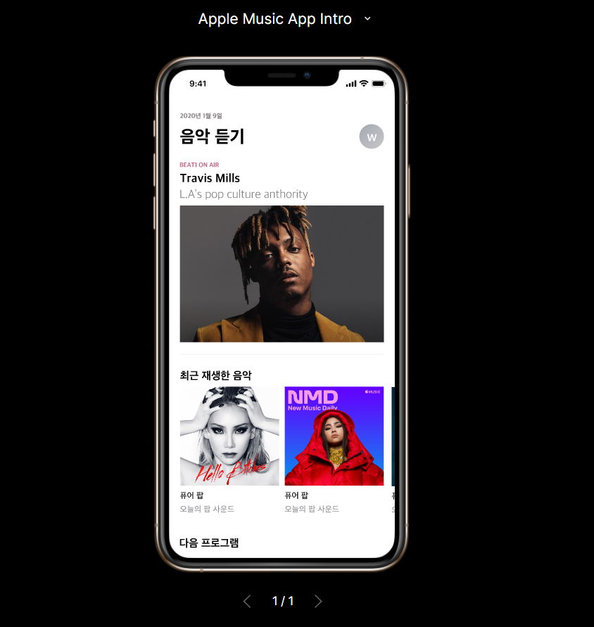
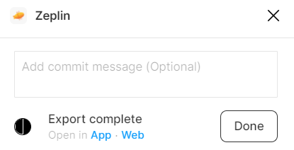
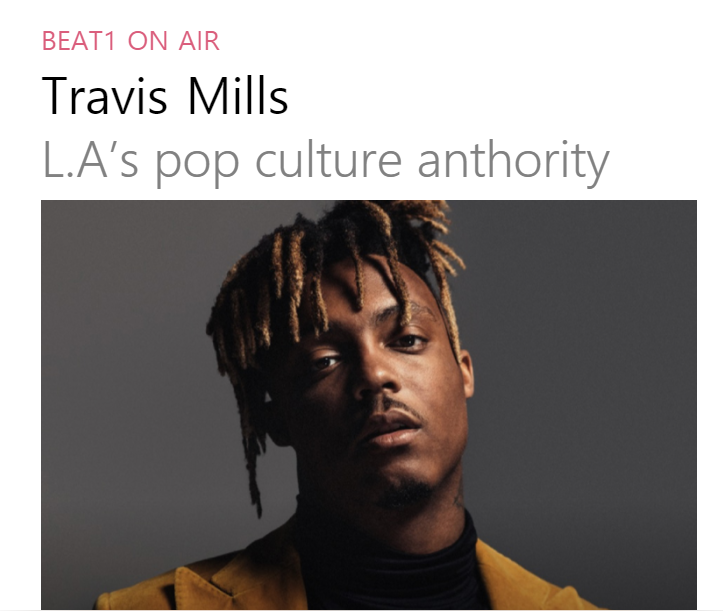
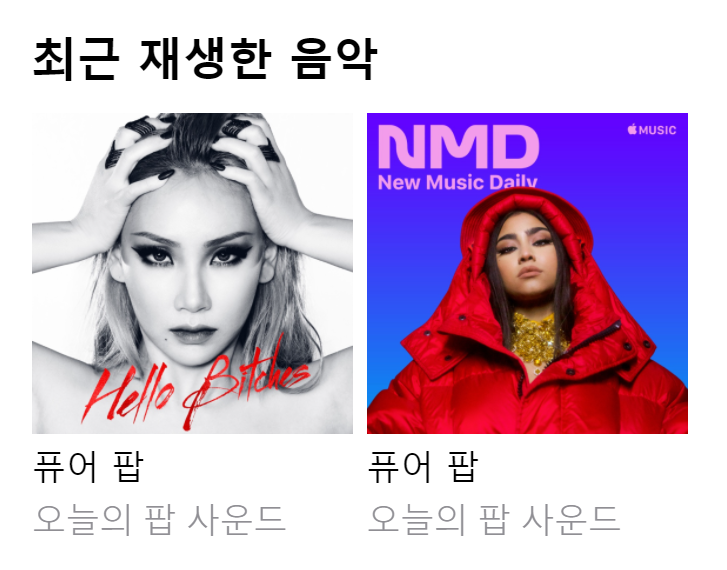
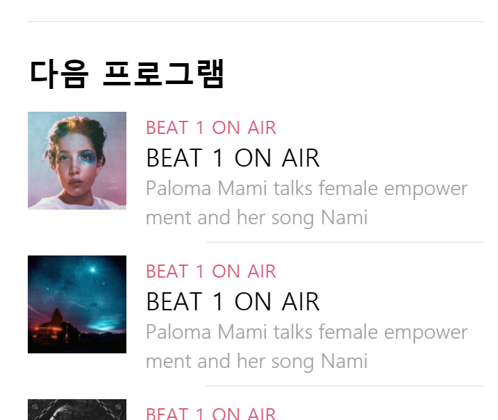
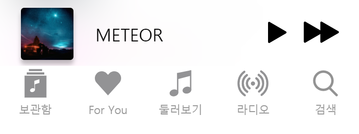

# euion-study

<h1>웹 공부</h1>

<h1> UI/UX </h1>
<h2> 피그마 & 제플린 - 클론 코딩 <h2>

피그마와 제플린을 활용하여 디자인과 클론코딩을 진행해보았다.

<h2>1. 피그마로 기초 디자인 작업</h2>

 피그마로 애플 뮤직의 모바일 버전 기본 디자인을 연습해보았다. 이때 실습과정에서 Integrations에서 Zepiln이 열리지 않는 경우가 발생하였다.

<h2>2. 피그마 코드화</h2>

피그마 코드화를 위해서는 제플린(Zeplin)과 연동시키면 좋다. 피그마 안에서도 코드를 제공하지만 제플린의 경우 피그마와 함께 사용하면 좋을 기능을 추가로 제공한다 (예를 들면 swift 코드)

<pre><b>[Zeplin 연동 방법]<b>

1. Zeplin for Figma 플러그인 설치 : https://www.figma.com/community/plugin/745330164019088593/Zeplin
2. export하려는 Frame을 선택한 뒤, 왼쪽 상단의 버튼 클릭 'plugin' -> 'zeplin'을 클릭 
3.export 를 위한 로딩화면이 출력되며 로딩이 종료되면 Zepline Wep App이 열린다. 이때 어떤 프로젝트 파일에 업로드 할지 선택할 수 있다.
4. 업로드할 파일 선택
5. 업로드 후 확인! ui에 대한 코멘트가 있는 경우 comment를 남길 수 있다.

</pre>

<h3>2.1 header</h3>

<h3>2.2 Best Music</h3>

반응형 모바일 웹을 위해 이미지의 크기를 3단계로 나누어 적용되도록 하였다. 피그마에서 사진을 Export할때 이미지의 크기를 3단계로 나누어 내보낼수 있도록 설정 할 수 있다.

<h3>2.3 최근 재생한 음악</h3>

최근 재생한 음악의 경우

<h3>2.4 다음 프로그램</h3>

<h3>2.5 하단 재생 & 어플 네비게이션 바</h3>

리모컨처럼 고정되어 스크롤을 내려도 따라온다.

<h2>3. 웹 호스팅</h2>

연습한 작업물을 github로 호스팅해보았다. 

<a href = "https://kmulikelionstudy.github.io/Euion-study/figmaPrac/apple01.html">애플뮤직</a>
