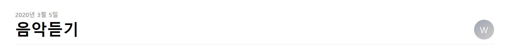

# euion-study

<h1>웹 공부</h1>

<h1> UI/UX </h1>
<h2> 피그마 <h2>
<h2>1. 피그마로 기초 디자인 작업</h2>

 피그마로 애플 뮤직의 모바일 버전 기본 디자인을 연습해보았다.

 
<h2>2. 피그마 코드화<h2>

피그마 코드화를 위해서는 제플린(Zeplin)과 연동시켜야 한다.

<pre><b>[재플린 연동 방법]<b>
1.
2.
3.
</pre>
<h3>2.1 header</h3>

<a href = "https://kmulikelionstudy.github.io/Euion-study/figmaPrac/apple01.html">애플뮤직
