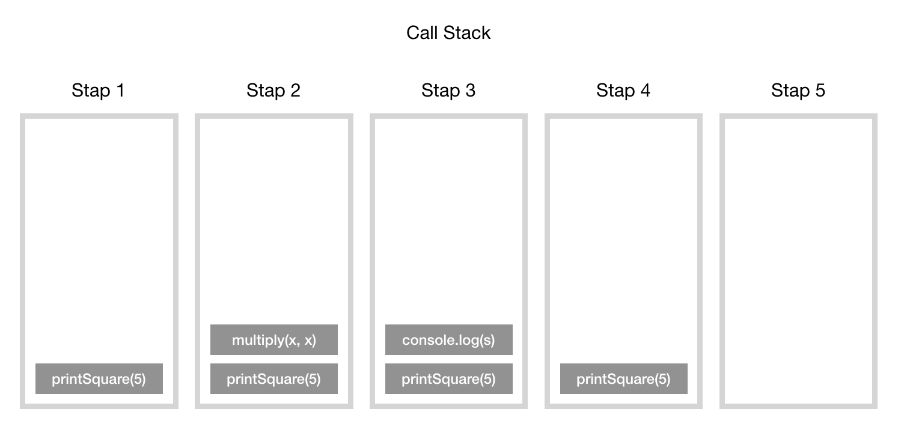
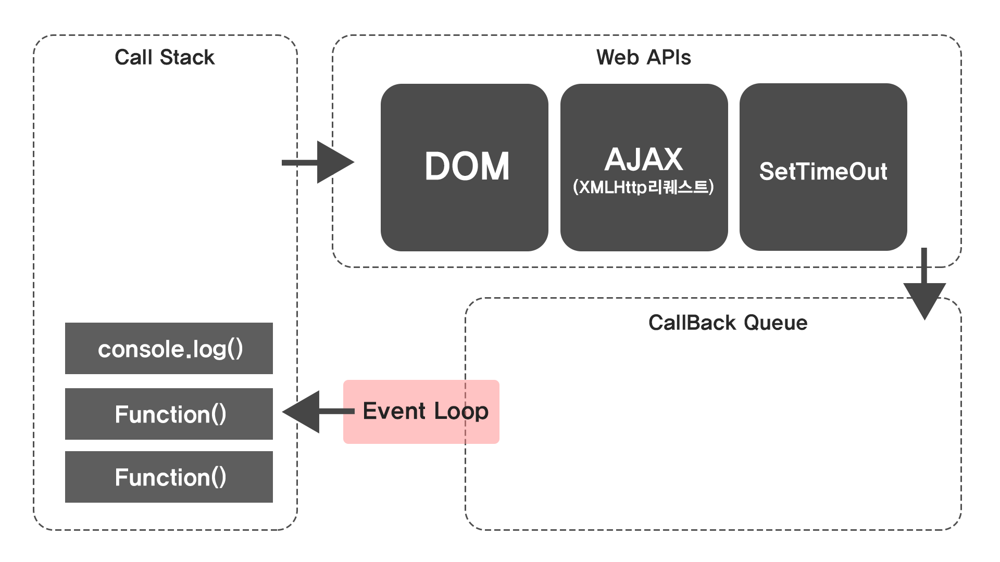
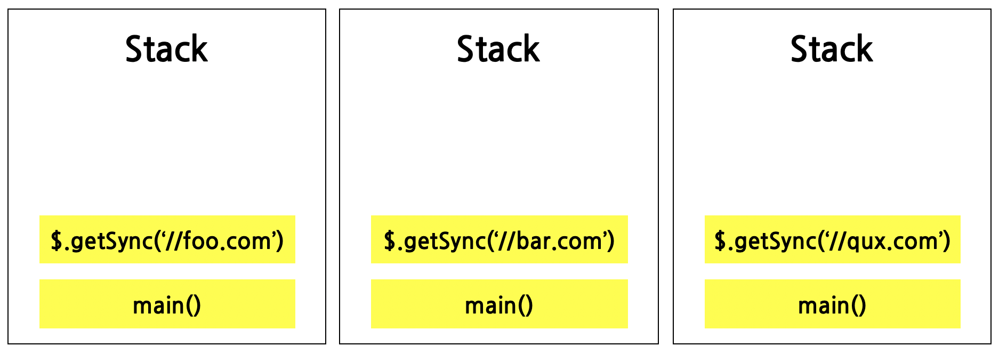
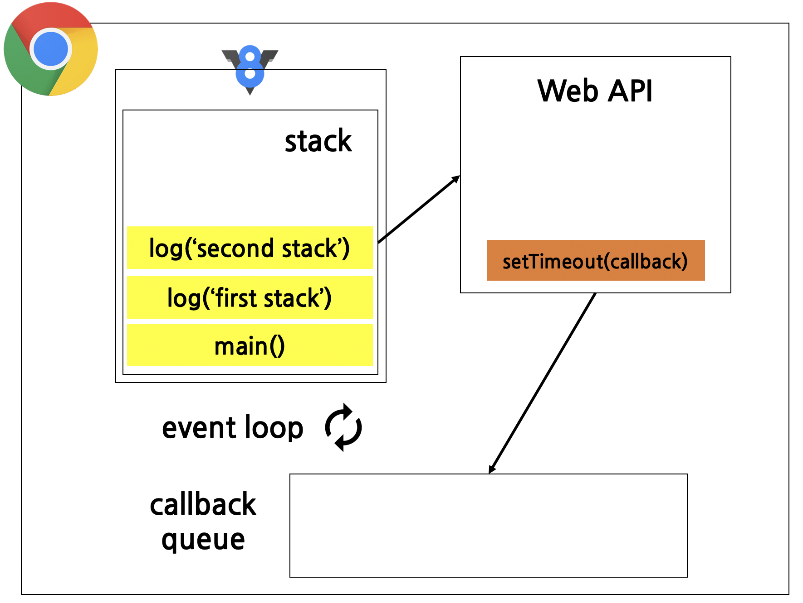
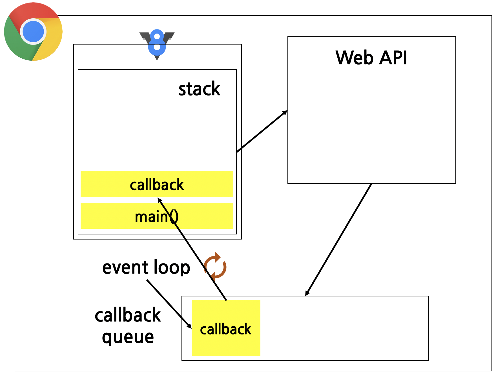

<h1>JS 런타임 정리</h1>

<h2>자바 스크립트 엔진<h2>
<p>자바스크립트 엔진이란 자바 스크립트 코드를 실행하는 프로그램 또는 인터프리터를 말한다.  자바스크립트 엔진은 표준적인 인터프리터로 구현할 수도 있고 또는 정적 컴파일러로 구현할 수도 있다. 대표적인 자바스크립트 엔진으로 구글이 개발한 V8과 웹킷이 있다. V8은 크롬과 노드 안에서 동작한다. 자바스크립트 엔진은 다음과 같은 두가지 주요 구정 요소로 이루어져 있다.</p>

<ul>
    <li><b>메모리 힙(Memory Heap)</b> - 객체는 힙, 대부분 구조화되지 않은 메모리 영역에 할당된다. 변수와 개게에 대한 모든 메모리 할당은 여기서 발생한다.</li>
    <li><b>호출스택(Call Stack)- 코드가 실행될 대 호출스택이 쌓인다.</b></li>
</ul>

<h2>호출스택(Call Stack)</h2>
<p>자바스크립트는 단일 스레드 프로그래밍 언어이다. 때문에 단일 호풀 스택을 가지고 있다. 이때 단일 호출 스택이 있다는 것은 한번 에 하나의 일만 처리할 수 있음을 뜻한다.</p>
<br>
<p>call stack이란 프로그램에서 우리가 어디에 있는지를 기본적으로 기록하는 데이터 구조이다. 동작방식은 다음과 같다. 함수를 실행하면 해당 함수의 기록을 stack 맨 위에 Push하게 된다. 우리가 함수의 결과값을 반환하면 stack에 쌓여있던 함수는 제거(pop)된다. 예제를 살펴보면 다음과 같다. </p>

```javascript
function multiply(x, y) {
    return x * y;
}
function printSquare(x) {
    var s = multiply(x, x);
    console.log(s);
}
printSquare(5);
```
<p>엔진이 이 코드를 실행하기 전에는 호출 스택이 비어있다. 가장 아랫줄에 printSquare 함수가 실행되면 이후 단계는 다음과 같다 이때 호출스택의 각 항목을 스택프레임이라고 한다.</p>


<b>callstack 한줄요약 : 하나의 쓰레드 = 하나의 콜 스택 = 한번에 하나의 작업</b>
<p>JS는 싱글 쓰레드 언어이며 위와 같이 한번에 하나의 코드를 실행할 수 있다는 것을 뜻한다.는 곧 한번에 하나의 콜 스택을 가질 수 밖에 없다는 것을 말한다.</p>


<h2>Web APIs</h2>
<p>Web API는 자바스크립트 엔진이 아니라 브라우저에서 제공하는 API이다. call stack에서 불러온 함수 중 비동기적인 함수이면 Wdb API가 이것의 Run함수를 호출한다. 비동기적 함수의 처리이므로 DOM, Ajax, SetTimeout 등이 Web API에 해당하며 처리가 끝난 함수는 Callback Queue로 이동된다. </p>

<p>예를 들어 SetTimeOut(Function(){}, 3000) 으로 3초짜리 비동기 함수가 있다면 Web APIs에서 3초짜리 타이머가 생성된다.3초를 이곳에서 머루른 이후 Web APIs는 이 Run함수를 Callback Queue으로 이동시킨다.</p>

<p>지금까지 배운 콜 스택의 개념을 활용하면 콜 스택에 차례대로 쌓일 것 같지만, V8의 소스코드에는 setTimeout 함수가 없기 때문에 웹 브라우저가 대신 실행해주어야 한다. 여기서 바로 “동시성” 개념이 나온다. 즉, JS가 싱글 쓰레드 기반임에도 불구하고 동시성 언어라고 부르는 이유는 웹 브라우저가 제공하는 API를 통해 동시에 작업을 할 수 있기 때문이다. </p>

<h2>Callback queue</h2>
<p>JavaScript런타임은 처리할 메세지 목록인 메시지 대기열을 사용한다. 이때 메시지를 처리하기위한 메시지 대기열을 callback queue라고 한다.</p>

<p>각 메시지에는 이를 처리하기 위해 호출되는 관련 함수가 존재한다. 자바스크립트 코드가 실행 중에 이벤트를 만나면 해당 이벤트들은 차곡 차곡 callback queue에 쌓인다. event loop중 어떤 시점에서 런타임은 대기열에서 가장 오래된 메시지부터 처리하기 시작한다(선입선출). callback queue는 비동기 코드가 push되고 실행을 기다리는 곳이다.</p>

<h2>Render queue</h2>

<h3>블로킹(Blocking)<h3>
<p> 블로킹(Blocking)은 콜 스택에 현재 느리게 동작하는 작업이 남아있는 것을 말한다. 대표적인 예시로 네트워크 요청 혹은 이미지 프로세싱 등이 있다.</p>

```javascript
var foo = $.getSync('//foo.com');
var bar= $.getSync('//bar.com');
var qux = $.getSync('//qux.com');

console.log(foo);
console.log(bar);
console.log(qux);
```
<p>위 코드는 jQuery를 통해서 동기적으로 네트워크 요청을 3번 하는 코드이며 다음과 같이 콜 스택이 진행된다.</p>


<p>네트워크 요청은 느린 작업이기 때문에 다음 작업이 곧장 실행되지 않고 현재 진행되는 작업이 끝날 때까지 기다린 후에 다음 작업이 실행되고 있다. 이 방식이 문제가 되는 이유는 바로 코드가 웹 브라우저에서 실행되고 있기 때문이다. 느린 작업으로 인해 blocking이 발생하게 되면 웹 브라우저는 렌더링을 하지 못하고 다른 코드 또한 실행할 수 없게 된다. 즉, 사용자의 경험을 막게 된다. 따라서 다른 방식을 통해서 다음과 같은 작업을 해결해야 하는데 그걸 위한 것이 바로 “비동기 콜백” 이다.</p>

<h3>비동기 콜백(Asynchronous Callback)</h3>

<p>일반적으로 비동기 콜백을 설명할 때 가장 많이 사용하는 함수가 바로 setTimeout 이다. 주어진 시간만큼 기다렸다가 콜백함수를 실행하는 이 함수는 JS엔진인 V8에 내장되어 있지 않다.위에서 설명했듯 settimeout은 웹 브라우저에서 제공하는 Web API에 존재한다. 아래 코드를 보면서 비동기 콜백이 어떻게 이루어지는지 확인하자.</p>

```javascript
    console.log('First Stack');
    setTimeout(function callback(){
    console.log('Asynchronous Callback');
    }, 3000);
    console.log('Second Stack');
```
<p>지금까지 배운 콜 스택의 개념을 활용하면 콜 스택에 차례대로 쌓일 것 같지만, V8의 소스코드에는 setTimeout 함수가 없기 때문에 웹 브라우저가 대신 실행해주어야 한다. 여기서 바로 “동시성” 개념이 나온다. 즉, JS가 싱글 쓰레드 기반임에도 불구하고 동시성이라고 부르는 이유는 JS에서 웹 브라우저가 제공하는 API를 통해 동시에 작업을 할 수 있기 때문이다. 이걸 그림으로 보면 다음과 같다.</p>


<p>처음엔 순서대로 쌓이다가 setTimeout 함수를 웹 브라우저에게 맡기고 두 번째 log 를 쌓는다. 따라서 아래와 같이 먼저 출력되는 것이다.</p>


<p>이제 콜 스택에서 main() 을 제외한 모든 함수가 리턴되고 Web API의 setTimeout 타이머가 종료되면 해당 콜백이 콜백 큐로 전달된다. 이제 여기서 이벤트 루프의 역할이 나오는데 이벤트 루프는 콜 스택과 콜백 큐를 감시하는 역할로 콜백 큐에 함수가 존재하고 콜 스택이 비었다면 콜백 큐에서 콜백을 꺼내 콜 스택에 넣어주는 역할을 한다. 아래와 같이 동작하는 것이다.</p>

<p>이것이 가능한 이유는 웹 브라우저가 담당했다가 콜백 큐로 가고 그 다음에 이벤트 루프가 콜백 큐에서 콜 스택으로 옮기는 과정을 거치기 때문이다. 따라서 setTimeout 을 연속으로 호출하는 경우 또한 기대하는 지연 시간과 다른 값이 나올 수 있다.</p>


<h3>비동기 콜백을 통한 블로킹 완화</h3>
<p>기본적인 콜백 방식의 문제점은 웹 브라우저의 렌더링을 못하게 하여 UI를 블로킹 시키는데 있다고 했다. 웹 브라우저는 1초에 60 프레임을 다시 그리는게 가장 이상적인 경우인데, 렌더링 또한 콜백 처럼 작용해서 콜 스택에 들어가게 된다. 하지만 콜 스택에서 어떤 작업이 지연되고 있을 경우 렌더링을 못한다. 따라서, 느린 작업이 동기적으로 콜 스택에 있게 되면 렌더링을 못하게 되고 그에 따라 UI가 블로킹 되는 현상이 발생하는 것이다. 렌더링을 할 때는 렌더 큐(Render Queue) 또한 존재해서 이벤트 루프가 콜백 큐를 감시하는 것과 비슷한 방식으로 콜 스택이 비었을 경우 렌더링을 시도한다. 비동기 콜백으로 작업을 실행하게 되면 콜 스택이 비는 때가 존재하기 때문에 렌더링이 될 수 있는 틈을 준다. 이것이 바로 비동기 콜백을 사용하는 이유이다.</p>